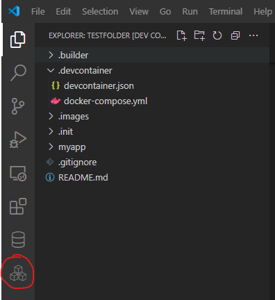
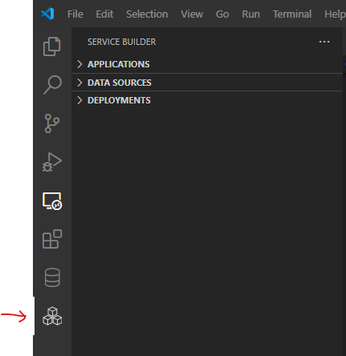
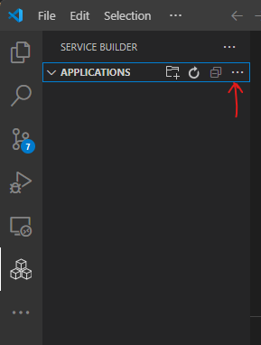

# Service Builder DevContainer

## Overview

This project creates a development environment on your local machine for data access service. It

- Creates and starts a Dev Container `builder` and installs the following VS Code extensions:

  - `Service Builder Extension Pack`, the development tool for data access services. 
  - `Database Client Extension`, a database tool for PostgreSQL, MySQL and others.  
    > [Here is a quick start for Database Client.](https://database-client.com/#/document)

- Creates and starts a DAS development server container `devtime`.
- Creates and starts a MySQL database container `mysql`, preinstalled with the `classicmodels` sample database.
- Creates and starts a PostgreSQL database `postgres`, preinstalled with the `pagila` sample database.


## Get Started

### Prerequisites

- Docker installed locally.
- Git and Git Bash installed locally.
- VS Code installed locally.
- Familiar with VS Code and Dev Container.

[VS Code DevContainer Overview](https://code.visualstudio.com/docs/devcontainers/containers)

> Note: Open a (Git) bash window. All bash commands in the following are issued in this window.

### Clone This Project

Clone this project with the following commands:

```sh
git clone git@github.com:bklogic/service-builder-devcontainer.git builder
cd builder
```

### Open Project in VS Code

Open VS Code with the following command in bash window:

```
code .
```

> Note: Install Dev Container extension when prompted. It is critical to have the Dev Container extension installed.

### Reopen Project in Development Container

- Press F1 to invoke the Command Palette.
- Type and select "`Dev containers: Reopen in Container`".

    > [Quick start: Open an existing folder in a container](https://code.visualstudio.com/docs/devcontainers/containers#_quick-start-open-an-existing-folder-in-a-container)

This step

- Creates and starts Dev Container `builder`.
- Creates and starts development server `devtime`.
- Creates and starts MySQL database `mysql`.
- Creates and starts PostgreSQL database `postgres`.
- Installs `Service Builder Extension Pack` and `Database Client` VS Code extensions.

This step complets when the `Service Builder` icon  and the `Database Client` icon  appear on the `Activity Bar`, as shown in the following:



In addition, the `docker ps` command should list the following containers:

- `builder`, the dev container
- `devtime`, the DAS development server
- `mysql`, MySQL service preloaded with `classicmodels` sample database and
- `postgres`, PostgreSQL service preloaded with `pagila` sample database.

### Activate Service Builder

Click the `Service Builder` icon  on the `Activity Bar`. The `Service Builder` view opens:



### Register Service Builder with Dev Server

Registering the Service Builder with the Dev Server creates and connects the Service Builder with a workspace on the Dev Server.

- Click the `Applications` bar, then the `more` icon `...`, and select `Register Builder`.

  

- Enter "http://localhost:8080" in the input box and press enter.

The Service Builder is registered with the Dev Server.


## Troubleshoot

In case of error when reopening the project in container, 

- list the docker containers:

    ```
    docker ps -a
    ```

- remove dev container `builder`, if exists, so that it can be rebuild:

    ```
    docker rm builder
    ```

- reopen project in container

> Note: There may be situations where you also need to first remove the `devtime`, `mysql` and `postgres` containers.


## File Structure

### The `.devcontainer` Folder

- `devcontainer.json`

  This file defines the Dev Container.

- `docker-compose.yml`

  This files configures the DevContainer, the DevServer, a MySQL database and a PostgreSQL database. This file may be modified based on your own needs.

  ```yml
  version: "3.3"

  services:
    # DevContainer
    builder:
      image: "mcr.microsoft.com/devcontainers/base:alpine-3.19"
      container_name: "builder"
      command: 
        - sh
        - -c
        - |
          apk update && apk add --no-cache git
          git config --global --add safe.directory /workspaces/testfolder
          sleep infinity
      volumes:
        - ../../:/workspaces:cached
        - ~/.ssh:/home/vscode/.ssh
      network_mode: service:devtime

    # MySQL DB
    mysql:
      image: "mysql:8.2.0"
      container_name: "mysql"
      ports:
        - "3306:3306"
      environment:
        - MYSQL_ROOT_PASSWORD=password123
        # create database `classicmodels` and user `sample`. modify for your own needs.
        - MYSQL_DATABASE=classicmodels
        - MYSQL_USER=sample
        - MYSQL_PASSWORD=password123
      restart: always
      deploy:
        resources:
          limits:
            memory: 256M
      volumes:
        # initialize database with sql scripts in `../.init/mysql`
        # default to creating classicmodels tables. modify for your own needs.
        - ../.init/mysql:/docker-entrypoint-initdb.d

    # Postgres DB
    postgres:
      image: "postgres:15.6"
      container_name: "postgres"
      ports:
        - "5432:5432"
      environment:
      # create database `pagila` and user `sample`
      - POSTGRES_DB=pagila
      - POSTGRES_USER=sample
      - POSTGRES_PASSWORD=password123
      restart: always
      volumes:
        # initialize database with sql scripts in `../.init/postgres`
        # default to creating pagila tables. modify for your own needs.
        - ../.init/postgres:/docker-entrypoint-initdb.d

    # DevServer
    devtime:
      image: "public.ecr.aws/backlogic/service-builder:latest"
      container_name: "devtime"
      ports:
        - "8080:8080"
      environment:
        - spring.profiles.active=prod
        - runtime.engine.hikari-cp-config.maximumPoolSize=5
      restart: "unless-stopped"
  ```

### The `.init` Folder

- `mysql`

  This subfolder folder contains the `SQL` scripts to initialize the MySQL database. By default, it installs the `classicmodels` sample database.

- `postgres`

  This subfolder folder contains the `SQL` scripts to initialize the PostgreSQL database. By default, it installs the `pagila` sample database.

> Note: you may replaces the SQL scripts in the `.init` folders with your own.

