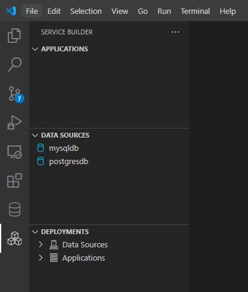

# RDAS (Relational Data Access Service) DevContainer

## Overview

This project creates a VS Code Dev Container on your local machine for data access service. It

- Installs `Service Builder Extension Pack`, the development tool for data access services. 
- Installs `Database Client Extension`, a database tool for PostgreSQL, MySQL and others.

    [Database Client Quick Start](https://database-client.com/#/document)


## Get Started

### Prerequisites

- Docker installed locally.
- Git and Git Bash installed locally.
- VS Code installed locally.
- Familiar with VS Code and Dev Container.

[VS Code DevContainer Overview](https://code.visualstudio.com/docs/devcontainers/containers)


### Clone This Project

Open a (Git) bash window and issue following commands.

```sh
mkdir ~/workspaces
cd mkdir ~/workspaces
git clone git@github.com:bklogic/devcontainer.git rdas
cd rdas
```

### Open Project in VS Code

Issue the following command in bash window.

```
code .
```

Install Dev Container extension when prompted.

> Note: It is critical to have the Dev Container extension installed.

### Reopen Project in Development Container

- Press F1 to invoke the Command Palette
- Type and select "`Dev containers: Reopen in Container`"

    [Quick start: Open an existing folder in a container](https://code.visualstudio.com/docs/devcontainers/containers#_quick-start-open-an-existing-folder-in-a-container)

This step

- Creates and starts Dev Container `rdas`.
- Creates and starts builder server `builder`.
- Creates and starts MySQL database `mysql`.
- Creates and starts PostgreSQL database `postgres`.
- Installs `Service Builder Extension Pack`, the development tool for data access services. 
- Installs `Database Client`, a database tool for PostgreSQL, MySQL and others.

    [Database Client Quick Start](https://database-client.com/#/document)

This step ends when the `Service Builder` icon  and `Database Client` icon  appear on the `Activity Bar`, as shown in the following:


In addition, the `docker ps` command should lists:

- rdas, the dev container
- builder, the DAS development server
- mysql, MySQL service preloaded with `classicmodels` sample database and
- postgres, PostgreSQL service preloaded with `pagila` sample database.

### Activate Service Builder

Click the `Service Builder` icon  on the `Activity Bar`. The `Service Builder` view opens:




## Troubleshoot

In case of error when openning the project in container, 

- list the docker container:

    ```
    docker ps -a
    ```

- remove dev container `rdas`, if exists

    ```
    docker rm rdas
    ```

- reopen project in container


## File Structure

### The `.devcontainer` Folder

- `devcontainer.json`

  This file defines the Dev Container.

- `docker-compose.yml`

  This files configures the DevContainer, the DevServer, a MySQL database and a PostgreSQL database. 

### The `.init` Folder

- `mysql`

  This subfolder folder contains the `SQL` scripts to initialize the MySQL database. By default, it installs the `classicmodels` sample database.

- `postgres`

  This subfolder folder contains the `SQL` scripts to initialize the PostgreSQL database. By default, it installs the `pagila` sample database.


